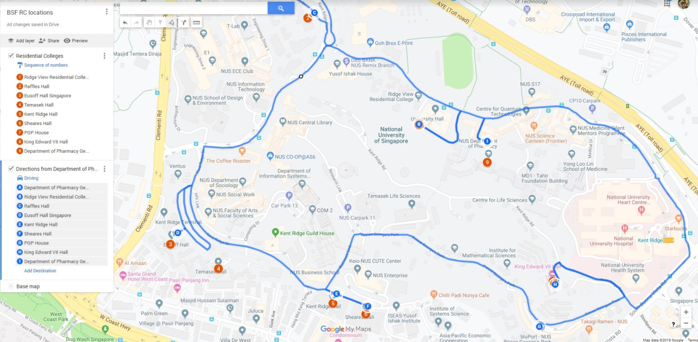
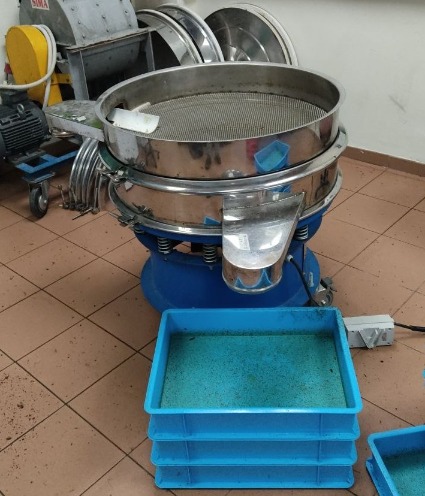
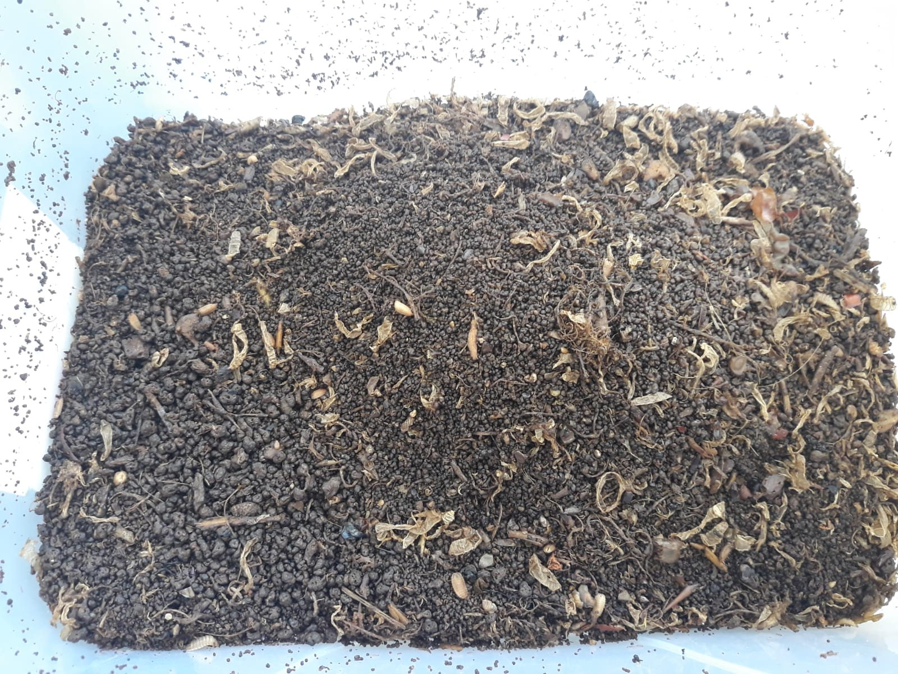

Welcome to the BSF Facility
===========================

Hello, welcome to the SOP for the BSF project for ~~Evolab~~ & Reprolab.
Read the Reprolab’s onboarding documents and get yourself added to the
lab’s MS Teams.

We would recommend heading over to the Mass rearing folder in General
Literature and reading the BSF manuals there. That should give you a
good overview of the BSF rearing process.

Lab equipment
-------------

We have a number of equipment in the BSF facility that may be used.
These include:

-   Food grinder
-   Mechanical sieve and smaller hand sieves
-   Feeding trays
-   Cages of different sizes (XL:60x60x180cm , L: 60x60x90cm, M:
    30x30x60cm, S: 30x30x30cm)\*
-   Racks, fixed and wheeled
-   Lights
-   Freezers (-20 C)
-   Balance (up to 0.001g)
-   Oven

\* We also have five XXL cages and a giant cage set up around the
facility for large number of flies.

Please read the relevant risk assessment before using them. Wash the
equipment after using it if needed.

### BSF cultures

Currently, we have five selection lines of BSF, labeled A to E. We
established an additional wild type line (SSS) around Oct or Nov 2020
using clutches from City Sprouts. The maintenance procedures are
outlined below in this document.

Data recording
--------------

In each of the below steps, there are things to be recorded in the MS
Teams ‘BSF cage records’, ‘BSF feeding and tray records 2021’ or ’BSF IO
2020-2021 sheets. Please refer to the readme sheet in the document to
familiarise yourself with it. It is helpful to make a new one every year
as the sheets start to lag quite a lot over time. The old ones can be
placed in the archive folder.

------------------------------------------------------------------------

Food waste
==========

Food waste sources
------------------

For this project, one of the goals is to recycle the foodwaste around
the campus. We have targeted the residential halls and colleges that
provide meal plans as they seem to form a centralised bulk of the food
waste produced. There are nine halls and colleges that we can collect
food waste from. These are:

-   Eusoff Hall
-   Kent Ridge Hall
-   King Edward VII (KEVII) Hall
-   Raffles Hall
-   Sheares Hall
-   Temasek Hall
-   Cinnamon & Tembusu Colleges
-   College of Alice and Peter Tan (CAPT) & Residential College 4 (RC4)
-   Ridge View Residential College

At our current production rate, collection from just RVRC, CAPT and
Cinnamon is enough to meet our needs. The meal plans in these halls and
colleges are operated by a number of different caterers. Do check at the
start of the academic year if there has been any changes in the caterer.
If so, contact the dining service manager or the catering company’s
manager to arrange collection of the food waste.

We will collect leftover dining hall food from participating Residential
Colleges and Halls. Buffet-style meals are served twice daily, in the
morning and evening, after which, the leftover food that remains in the
serving tray is normally discarded. Instead of depositing the leftover
food in the trash, the dining hall staff will put the leftover food into
our wheeled 80L collection bins for our collection each day. The Office
of Sustainability suggests that all of the RC dining halls have similar
food service operations (buffet-style) and food amounts as RVRC
(\~40kg/day of leftovers including both breakfast and dinner). Assuming
that we can source food from all nine halls and colleges, we will likely
be able to source \~350-400kg/day. This amount is highly variable. It
can range from around 20kg to over 150kg in a day from a RC/Hall.

Food waste collection
---------------------

### Food waste collection arrangements

Prior to arranging for the collection, please check the availability of
the department vehicle at the DBS office. We usually book two
consecutive days at 1300-1400 hrs for the drop-off and collection of the
bins.

Because there are no refrigerators at the dining halls, we would provide
the dining halls with two, 2-wheeled 80-L bins in which to place the
buffet leftovers after each meal (one bin each for dinner and
breakfast). We eventually came to an agreement with the operators that
as long as the bins are covered and kept away from the kitchen area, a
standard, non-sealing wheelie bin should be fine. Ensure that the bins
are secured on the lorry bed with a ratchet strap.

We would collect food Monday - Friday or when needed. Each collection
will include the previous night’s dinner as well as that morning’s
breakfast at the same time at a designated pickup/dropoff usually
located near to the bin center of the halls. The breakfast service
timings also vary hall to hall but end by 11am. Plan some buffer time
(0.5 -1 hr) for the staff to empty the trays.

<figure>
<figcaption>Fig 1. Food waste collection route.</figcaption>
</figure>

### School holidays

During the semester breaks, the food service will not be running.
Alternative arrangements from outside the campus will have to be made to
continue feeding the BSFs over during this time. For the December break,
we can store sufficient food in the drums (\~1 ton at full capactity).

For the summer break, this is unlikely to be enough and other sources of
food will have to be explored. Some food waste may be collected from the
canteen operators but this is unlikely to be sufficient. We have tried
to stock up on dry goods such as biscuits as feed but this is not
optimal for BSFs. Okara delivery can be arranged with TL. We are
currently accepting about 300kg every two weeks (Jun 2021). Collection
of spent grains can be arranged with Brewerkz. We notice higher than
normal mortality in the trays during this period, especially with
biscuit mixes. With okara, the larvae seem to prepupate and reach a
smaller final size. Food service should resume a week before the new
semester starts.

Food waste processing
---------------------

On returning from food collection, bins containing food waste are
unloaded from the lorry bed. They are then wheeled to the main area and
weighed. \#\#\# Raw! If the food waste is to be fed fresh, it is then
fed into the grinder or handheld mixer depending on the amount of food
waste collected. If the food waste is too dry, water might have to be
added. If the food waste is too wet, dry substrate such as bread or
biscuits will be added to reduce the wetness of the food. These
additional steps helps to homogenise the quality of food waste and the
optimal moisture content for the larvae.

### Fermentation!

#### EMAS preparation

During the holidays or for general feeding, we might want to ferment
food. It is also good to ensure a more similar microbiome across the
trays. For fermentation, we are using EM1 solution. We prepare it by
mixing EM1, molasses and water in a 1:1:20 ratio ( \~ 5L of EM1 and
molasses in a blue drum). After 1-2 weeks, the solution should turn a
lighter shade of brown and it is then ready for use (EMAS). The EMAS can
then be stored for a few months. You can refer to the brochures for
instructions.

#### Using EMAS

So far, we have tried adding 10L of EM1 per bin (approximately 1:10 EMAS
to food waste) which seems to work well. The EMAS solution can be added
while food is being added or at the end before being mixed. The food
should be filled up roughly to the handles of the bin (\~the handle
squares on the inside of the bins). Filling beyond that point might lead
to food overflowing from the bin during fermentation. The bins attract
escapee BSFs and phorids to oviposit on the bins. To prevent stray
maggots from entering the bins, cover the bin first with cling wrap
before placing the lid.

Due to the breakdown of the food and the extra liquids added, the
fermented food might be watery at the bottom of the bin. It is
recommended to mix it well before serving or grains can be added or the
chunks of food can be sieved. Each drum of fermented food should be good
for about three months.

Ideally, the EM1 should not be used for \>1 generations as the community
of microbes might change but we have been using it fine so far.. After
four o five generations, the EM1 seems getting less effective. It might
be good to start a new culture after the fourth generation.

------------------------------------------------------------------------

Nursery
=======

Egg traps are replaced every Monday, Wednesday and Thursday. The eggs
are collected from the mating cages should be between 2-3 days old. The
egg traps are then weighed to determine the weight of eggs on it.
Nurseries should be set up immediately in case of early hatching.
Currently, nurseries are made using chicken feed sourced from Lian Wah
Hang Quail Poultry Farm / Phira’s cheaper chicken feed contact @ Bukit
Batok. Generally, \~100g of dry chicken feed is added to 1g of BSF eggs
at 60% moisture, rounded to the closest 0.1g of eggs. A maximum of 5g of
eggs in used in each nursery as the chicken feed layer will get too
thick.

| Mass of eggs (g) | Dry chicken feed (g) | Water (g) | Container size |
|------------------|----------------------|-----------|----------------|
| \<1              | 100                  | 150       | Small          |
| 1-2              | 100-200              | 150-300   | Medium         |
| 2-3              | 200-300              | 300-450   | Large          |
| 3-4              | 300-400              | 450-600   | Large          |
| 4-5              | 400-500              | 600-750   | Large          |

Once the chicken feed has been mixed with water, we let it sit for an
hour. The chicken feed will absorb the water and cake up. An elevated
platform made of flexible wire mesh or a mini steaming tripod can be
used to support the egg traps too ensure that the egg traps remain dry.
The nurseries are then covered with a paper towel which is secured by a
cut-out cover to prevent phorids from infesting the nursery. They are
placed in individual small cages before being put into the large cage
according to their line. The nurseries are left there for seven to ten
days before being trayed. Midway through, it is good to mix and aerate
the nurseries to prevent any caking of the chicken feed.

Using chicken feed (\~$3/kg) nurseries will add on quite a substantial
amount to our expenses. Food waste nurseries are probably more
financially sustainable but it might lead to losses from escapees or
slower growth of the larvae. We have tried food waste nurseries before
but did not quantify losses. Nurseries comprised of a food waste +
chicken feed (or okara) mix have shown to be effective, and could
minimize escapes by being slightly drier and provide more structure to
the substrate. This will require further investigation to determine a
suitable nursery mix.

We have been playing around with doubling the ratio of food to maggot
ratio in a larger container. This is similar to the ratio used by Steffi
(100g of dry feed : 0.5g of eggs). This *seems* to give a higher
survival rate but the bulk of the eggs are still nurseries based on the
standard ratio above.

#### Misc tips

-   We buy 25kg of chicken feed each time. This lasts us about 1-2
    months depending on the amount of eggs collected. We store the bag
    of chicken feed in a vacuum bag and remove the air using a wet/dry
    vacuum. This seems to allow us to keep the chicken feed fresh for a
    longer time and prevents the spread of mites.

-   Lightly knock the side of the cage to chase the flies away before
    retrieving the trap. A quick flick of the trap should get rid of
    most flies without damaging the eggs. If the trap is very full,
    sweeping off the flies with a finger might be preferable.

-   The BSFs commonly oviposit along the zips of the cages. If you are
    not careful, you may bring eggs from one cage to another and mix up
    the lines.

------------------------------------------------------------------------

Traying and feeding
===================

Nursery quantification and traying
----------------------------------

After about 7-10 days, the nurseries should be ready (dry) to be trayed.
Smaller nurseries tend to dry up sooner than the large ones. It might be
helpful to remove the cardboard traps early on to encourage more airflow
and faster drying times. Wet cardboard also tends to breakdown in the
nursery which makes sieving it more difficult. This has become less of a
problem with the tripod stands.

Once the nursery is dry, we will remove as much substrate as possible
from each nursery (ie dried clumps with no larvae). This is done by
sieving the mixture through an appropriate small sieve (\~1mm and \~4mm
or the noodle sieve). The remaining larvae tends to clump together in
panic and more substrate can be removed by skimming off the top
substrate. The larvae and remaining substrate will be homogenized. The
number of larvae in the nursery is estimated by counting the number in a
small sample (3 x \~1.5g), which is then extrapolated based on the total
weight of the nursery. The larvae are then distributed into batches of
approximately 10,000, which are then added to each blue tray with food
waste. Check the “BSF Feeding and Tray records” for more details.

In the rearing area, there are four rows of racks for each line. Trays
from the same week are placed on the same row to keep it orderly. Each
week, the oldest trays are harvested and replaced by new trays.
Currently, we target about 6 trays/line/week. But this might change
depending on the backlog and available manpower.

Feeding
-------

Ideally, each tray would be fed once at the start of it’s lifespan,
enough for the maggots to reach maturity. We have done some preliminary
trials and a ratio of 3-5kg : 10,000 maggots in a blue tray seem to do
quite well. However, due to concerns with odours and escapees, we have
changed to multiple feedings.

Each tray starts out with one large scoop of spent grains or okara or
milled biscuits (\~800g?). A depression is made in the center of the
scoop and a scoop of food waste is placed in the center in the
depression. The grains provide a dryer substrate and seem quite
effective in discouraging maggots from escaping. Each new tray is
labeled as such: Line-traydate-s/n. For example of maggots from line D,
trayed on 10 Sep 2020 will be labelled as ‘D-10092020-01’,
‘D-10092020-02’ and so on. The nursery number is also noted down to
allow us to ttrack the performance of specific nurseries. The trays are
then placed on their respective racks.

For existing trays, an additional flush scoop of food waste (\~500g) is
added to the tray every Monday, Wednesday and Friday or when the
substrate is dry. With certain types of food wastes (such as biscuits),
the substrate tends to dry quickly and cake up. Watering and mixing
might need to be done on an ad hoc basis if you notice caking. This
should not be an issue with foodwaste, okara or grains. The trays
continue to receive food until an estimated 40% of the larvae have
prepupated.

Overfeeding towards the end of the lifespan of the tray should be
avoided as the remaining maggots might not be able to finish the food,
resulting in an unsievable tray. The moisture also drives the prepupae
out of the trays, leading to lower harvest numbers and a mess.

------------------------------------------------------------------------

Harvesting
==========

Small scale harvesting
----------------------

If your experiment is on a smaller scale (yellow trays or smaller), you
may consider letting the larvae self harvest as prepuae migrate from
wetter areas in search of dry substrate to pupate in. This can be done
by placing a yellow tray in a larger blue tray and adding a wooden ramp
on the short side of the yellow tray. The self harvesting method will
not get all the prepupae out but it may be sufficient for your needs.
This can be combined together with manual sieving to get even more
prepupae out of the trays. If the resultant frass is not important at
the end of the experiment, you may want to flood the yellow tray and add
coco peat in the blue tray. This will chase out most of the prepupae but
the frass is lost.

Large scale harvesting
----------------------

For the operations of the BSF facility, self harvest is too unreliable.
Instead, we use the large mechanical sieve. It can fit up to three
layers of sieves with different mesh sizes. We have a number of sieves
of different sizes that can be swapped depending on your needs (10mm,
5mm, 3mm etc). The 5mm screen is most often used. The maggot tray should
be dry or the frass will clump up at the bottom pan. Attaching more
layers makes it run more slowly so we usually just use the 5mm sieve.

<figure>
<figcaption>Fig 2. Mechanical sieve with alternative screens behind.</figcaption>
</figure>

When ready, turn the sieve on and pour the tray in the center of the
screen. Fine frass will fall through to the bottom layer while larger
frass and maggots are retained on the upper layers. We usually do two
passes through the sieve by re-sieving the finest frass. This should
remove most all of the prepupae from the frass. Clean the screens and
the bottom to ensure that **maggots of different lines do not mix**. Run
the siever for a short while to get the stragglers out from the chutes
before moving on to the next tray. If you notice loud noises while
sieving, the nuts might need to be further tightened. Tightening (or
loosening) can be done quickly by using a drill with an adapter for the
nut. If the tray is still wet, the sieve will not work well. Let the
tray dry out for a day before assessing it again.

After sieving, a few measurements for the trays have to be taken.
Firstly, we weigh the frass and residue produced by the tray. Next, we
weigh the mass of the larvae. Lastly, prepupae percentage is estimated
by counting a few samples of larvae. This is done for a minimum of three
random trays per batch (per line per date). The frass goes into the
designated frass bins for composting or stored for botany or other
gardening interest groups. The trays of larvae are placed inside a large
cage and goes to the dark room. Each cage is to have between one to two
trays worth of maggots (total \~20,000 per cage). We usually place on
additional upside down tray in the cage to place the bait box. Remember
to label the cage so that we are able to track the amount of eggs from
each cage.

To save some time while retaining data, we sometimes follow the above
procedure for the first three trays. but aggregate the rest. For the
rest of the trays, they are sieved into a red bin and split into an
appropriate number of cages based on weight. The total amount of frass
is also weighed at the end and is entered into the sheets as an average.

<figure>
<figcaption>Fig 3. BSF frass</figcaption>
</figure>

Currently (Jun 2021), the populations are relatively stable and healthy.
The Wild Type line still needs to be boomed. Some trays can be harvested
earlier for other purposes if there’s sufficient manpower.

------------------------------------------------------------------------

Obtaining eggs
==============

Large cages
-----------

### Dark

Once the trays are placed in the cages, the cages are placed in the dark
room to build up a larger population of flies. Once a large population
of flies is established in a cage, it is brought out into the into and
placed along the row of windows. The cages are arranged from A on the
left to Wild Type on the right.

### Light

Once the cage is by the windows, a small tray of sugar water with
sponges can placed in the cage for the flies. This can be topped up
twice a week. Two days after being brought into the light, a bait box
with an egg trap is added into the cage. The bait box is made using
chicken feed, frass and water in a 1:1:3 ratio using the cat food
scoops. Usually, the small containers are used, covered with a fine mesh
and secured with a cover with the centre cut out. It should be quite
watery as it is expected to last for at least 2 weeks. These cages are
lit by natural sunlight.

<figure>
<figcaption>Fig 4. BSF bait boxes with traps</figcaption>
</figure>

XXL and beyond
--------------

If the row beside the window is fully used, we have a a number of XXL
cages set up around the facility and a giant cage in the small office.
The XXL cages and giant cage in the rooms are lit using artificial
lighting. These are supposed to be optimised based on the visible
spectrum of the BSFs. Please wear eye protection before going into the
rooms if the lights are on. The egg production with these cages have not
been as good as the large cages, perhaps due to a lower density but more
testing should be done ¯\\\_(ツ)\_/¯. Update(2021, Q2): Steffi’s trials
show little difference from sunlight, might be a density thing.

<figure>
<figcaption>Fig 5. Wavelength of LEDs in the rooms from the manufacturer</figcaption>
</figure>

Egg traps
---------

We have implemented the use of 2 different types of egg traps: wooden
traps and cardboard traps. Label the cage the trap is from so that we
can track the performance of the cages. Traps are replaced every Monday,
Wednesday and Friday until the cage is decommissioned when most of the
flies have died.

### Wooden trap

Wooden traps are made by bundling four layers of wood, separated by thin
wooden spacers. More traps can be made by cutting wooden planks to size
with the saw. Using wooden traps, eggs can be gently scraped out using a
penknife to obtain the egg weight. Scrap along the wooden grain to
minimise damage to eggs. The eggs are scraped out onto a thin plastic
card which can be placed in the nursery. The traps are then placed in
the dehydrator/oven for one to two hours to kill off any remaining eggs.
Once cooled, the trap can be used again.

<figure>
<figcaption>Fig 6. Example of a wooden trap</figcaption>
</figure>

### Cardbaord traps.

Cardboard traps are made by bundling 3-4 layers of cardboard. Each trap
is approximately 15x1.5cm. After the trap has been secured with a rubber
band, weigh the trap and write it on the cardboard. The weight of eggs
on the trap can be obtained by subtracting the final weight from the
initial weight of the trap. The cardboard traps can be placed on a
platform in nurseries.

<figure>
<figcaption>Fig 7. Example of a cardboard trap</figcaption>
</figure>

Conclusion & Checklists
=======================

Thanks.

After each major step, ensure that the following are done:

-   Feeding
    -   Feed tally sheets for each line has been updated (Amount of
        scoops/tray)
    -   Status of each tray is updated (Feeding/CUlled/Drying/Sick etc)
    -   Empty bins/ drums are washed
-   Traying
    -   New trays have been recorded into the feed tally sheets. (New
        rows of data)
    -   Tray tracking sheet is updated
-   Harvesting
    -   Latest ID on mini whiteboard has been updated
    -   Feed Tally sheets’ harvest columns has been updated (amount of
        frass and maggots collected, PPP%)
    -   Feed Tally’s Tray status has been updated (Feeding to Harvested)
    -   Tray tracking sheet is updated
    -   Cage tally sheet is updated (Records of new trays to be added)
-   Taking cages into light
    -   Cage tally sheet is updated (Light column updated with date)
-   Taking cages down
    -   Collect the masking tape tags from the cages to denote that
        they’ve been decommed
    -   Cage tally sheet is updated based on collected tags (Decomm
        column updated with date)
-   Egg collection
    -   Egg traps are replaced
    -   Have sufficient nurseries been made for the week?
    -   Does Oto or TL need more eggs
    -   Excess eggs are culled in a freezer so they do not hatch over
        work area
    -   Are there sufficient egg traps left for the next collection?
    -   If wooden egg traps are used, that they have been placed in the
        oven or dehydrator
-   Food collection
    -   Bins are washed
    -   Food collection sheet updated
