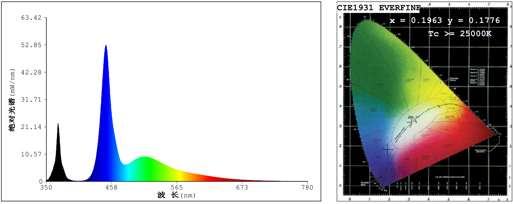

Welcome to the BSF Facility
===========================

Hello, welcome to the SOP for the BSF project for Evolab & Reprolab.
Read the Reprolab’s onboarding documents and get yourself added to the
lab’s MS Teams.

We would recommend heading over to the Mass rearing folder in General
Literature and reading the BSF manuals there. That should give you a
good overview of the BSF rearing process.

Lab equipment
-------------

We have a number of equipment in the BSF facility that may be used.
These include:

-   Food grinder
-   Mechanical sieve and smaller hand sieves
-   Feeding trays
-   Cages of different sizes (XL:60x60x180cm , L: 60x60x90cm, M:
    30x30x60cm, S: 30x30x30cm)\*
-   Racks, fixed and wheeled
-   Lights
-   Freezers
-   Balance (up to 0.001g)

\* We also have five XXL cages and a giant cage set up around the
facility for large number of flies.

Please read the relevant RAs before using them. Wash the equipment after
using it.

### BSF cultures

Currently, we have five selection lines of BSF, labeled A to E. We are
in the process of establishing more lines of local flies. The maintence
procedures are outlined below in this document.

Data recording
--------------

In each of the below steps, there are things to be recorded in the MS
Teams ‘BSF Facility data records’ sheet. Please refer to the readme
sheet in the document to familiarise yourself with it.

------------------------------------------------------------------------

Food waste
==========

Food waste sources
------------------

For this project, one of the goals is to recycle the foodwaste around
the campus. We have targeted the residential halls and colleges that
provide meal plans as they seem to form the bulk of the food waste
produced. There are currently nine halls and colleges that we collect
food waste from. These are:

-   Eusoff Hall
-   Kent Ridge Hall
-   King Edward VII (KEVII) Hall
-   Raffles Hall
-   Sheares Hall
-   Temasek Hall
-   Cinnamon & Tembusu Colleges
-   College of Alice and Peter Tan (CAPT) & Residential College 4 (RC4)
-   Ridge View Residential College

The meal plans in these halls and colleges are operated by a number of
different caterers. Do check at the start of the academic year if there
has been any changes in the caterer. If so, contact the dining service
manager or the catering company’s manager to arrange collection of the
food waste.

Food waste collection
---------------------

### Food waste amount

We will collect leftover dining hall food from participating Residential
Colleges and Halls. Buffet-style meals are served twice daily, in the
morning and evening, after which, the leftover food that remains in the
serving tray is normally discarded. Instead of depositing the leftover
food in the trash, the dining hall staff will put the leftover food into
our wheeled 80L collection bins for our collection each day. The Office
of Sustainability suggests that all of the RC dining halls have similar
food service operations (buffet-style) and food amounts as RVRC
(\~40kg/day of leftovers including both breakfast and dinner). Assuming
that we can source food from all nine halls and colleges, we will likely
be able to source \~350-400kg/day.

### Food waste collection arrangements

We would collect food Monday - Friday. Each collection will include the
previous night’s dinner as well as that morning’s breakfast at the same
time, sometime between 10:30 - 11:30am each weekday morning at a
designated pickup/dropoff usually located near to the bin center of the
halls. As such, dining staff would not collect Friday dinner, but would
collect Sunday dinner for collection with Monday’s breakfast. At the
time of collection, we will drop off two empty bins for the next
collection.

Because there are no refrigerators at the dining halls, we would provide
the dining halls with two, 2-wheeled 80-L bins in which to place the
buffet leftovers after each meal (one bin each for dinner and
breakfast). We eventually came to an agreement with the operators that
as long as the bins are covered and kept away from the kitchen area, a
standard, non-sealing wheelie bin should be fine.

<figure>
<figcaption>Fig 1. Food waste collection route.</figcaption>
</figure>

### School holidays

During the semester break, the food service will not be running.
Alternative arrangements from outside the campus will have to be made to
tide ths BSFs over during this time. Some food waste may be collected
from the canteen operators but this is unlikely to be sufficient. We
have tried to stock up on dry goods such as biscuits as feed but this is
not optimal for BSFs. We noticed higher than normal mortality in the
trays during this period. Food service should resume a week before the
new semester starts.

Food waste processing
---------------------

On returning from food collection, bins containing food waste are
unloaded from the lorry bed manually. They are then wheeled to the main
area and weighed. The food waste is then fed into the grinder or
handheld mixer depending on the amount of food waste collected. If the
food waste is too dry, water might have to be added. If the food waste
is too wet, dry substrate such as bread or biscuits will be added to
reduce the wetness of the food. These additional steps helps to
homogenise the quality of food waste and the optimal moisture content
for the larval consumption.

------------------------------------------------------------------------

Nursery
=======

Egg traps are replaced every Monday, Wednesday and Thursday. The eggs
are collected from the mating cages should be between 2-3 days old. The
egg traps are then weighed to determine the weight of eggs on it.
Nurseries should be set up immediately in case of early hatching.
Currently, nurseries are made using chicken feed sourced from Lian Wah
Hang Quail Poultry Farm. Generally, \~100g of dry chicken feed is added
to 1g of BSF eggs at 60% moisture, rounded to the closest 0.1g of eggs.
A maximum of 5g of eggs in used in each nursery as the chicken feed
layer will get too thick.

| Mass of eggs (g) | Dry chicken feed (g) | Water (g) | Container size |
|------------------|----------------------|-----------|----------------|
| \<1              | 100                  | 150       | Small          |
| 1-2              | 100-200              | 150-300   | Medium         |
| 2-3              | 200-300              | 300-450   | Large          |
| 3-4              | 300-400              | 450-600   | Large          |
| 4-5              | 400-500              | 600-750   | Large          |

Once the chicken feed has been mixed with water, we let it sit for an
hour. The chicken feed will absorb the water and cake up. Thoroughly mix
the moistened chicken feed and add a layer of dry coco peat. Ensure the
egg traps remain dry by placing them on top of the coco peat. An
elevated platform made of flexible wire mesh or a mini steaming tripod
can be used to support the egg traps. The nurseries are then covered
with a paper towel which is secured by a cut-out cover to prevent
phorids from infesting the nursery. They are placed in individual small
cages before being put into the large cage according to their line. The
nurseries are left there for one to two weeks before being trayed.
Midway through, it is good to mix and aerate the nurseries to prevent
any caking of the chicken feed.

Using chicken feed (\~$3/kg) nurseries will add on quite a substantial
amount to our expenses. Food waste nurseries are probably more
financially sustainable but it might lead to losses from escapees. We
have tried food waste nurseries before but did not quantify losses.
Nurseries comprised of a food waste + chicken feed (or okara) mix have
shown to be effective, and could minimize escapes by being slightly
drier and provide more structure to the substrate. This will require
further investigation to determine a suitable nursery mix.

#### Misc tips

-   We buy 25kg of chicken feed each time. This lasts us about 1-2
    months depending on the amount of eggs collected. We store the bag
    of chicken feed in a vacuum bag and remove the air using a wet/dry
    vacuum. This seems to allow us to keep the chicken feed fresh for a
    longer time and prevents the spread of mites.

-   Lightly knock the side of the cage to chase the flies away before
    retrieving the trap. A quick flick of the trap should get rid of
    most flies without damaging the eggs. If the trap is very full,
    sweeping off the flies with a finger might be preferable.

-   The BSFs commonly oviposit along the zips of the cages. If you are
    not careful, you may bring eggs from one cage to another and mix up
    the lines.

------------------------------------------------------------------------

Traying and feeding
===================

Nursery quantification and traying
----------------------------------

After about 7-10 days, the nurseries should be ready (dry) to be trayed.
Smaller nurseries tend to dry up sooner than the large ones. It might be
helpful to remove the cardboard traps to encourage more airflow and
faster drying times. Wet cardboard also tends to breakdown in the
nursery which makes sieving it more difficult.

Once the nursery is ready (dry), we will remove as much substrate as
possible from each nursery (ie dried clumps with no larvae). This is
done by sieving the mixture through an appropriate small sieve (\~1mm
and \~4mm). The remaining larvae tends to clump together in panic and
more substrate can be removed by skimming off the top substrate. The
larvae and remaining substrate will be homogenized. The number of larvae
in the nursery is estimated by counting the number in a small sample (3
x \~1.5g), which is then extrapolated based on the total weight of the
nursery. The larvae are then distributed into batches of approximately
10,000, which are then added to each blue tray with food waste.

Feeding
-------

Ideally, each tray would be fed once at the start of it’s lifespan,
enough for the maggots to reach maturity. We have done some preliminary
trials and a ratio of 3-5kg : 10,000 maggots in a blue tray seem to do
quite well. However, due to concerns with odours and escapees, we have
changed to multiple feedings.

Each tray starts out with one large scoop of spent grains or okara
(\~800g?). A depression is made in the center of the scoop and a scoop
of food waste is placed in the center in the depression. The grains
provide a dryer substrate and seem quite effective in discouraging
maggots from escaping. Each new tray is labeled as such:
Line-traydate-s/n. For example of maggots from line D, trayed on 10 Sep
2020 will be labelled as ‘D-10092020-01’, ‘D-10092020-02’ and so on. The
nursery number is also noted down to allow us to ttrack the performance
of specific nurseries. The trays are then placed on their respective
racks.

For existing trays, an additional scoop of food waste is added to the
tray every Monday, Wednesday and Friday or when the substrate is dry.
With certain types of food wastes (such as biscuits), the substrate
tends to dry quickly and cake up. Watering and mixing might need to be
done on an ad hoc basis if you notice caking. This should not be an
issue with foodwaste, okara or grains. The trays continue to receive
food until an estimated 40% of the larvae have prepupated.

------------------------------------------------------------------------

Harvesting
==========

Small scale harvesting
----------------------

If your experiment is on a smaller scale (yellow trays), you may
consider letting the larvae self harvest as prepuae migrate from wetter
areas in search of dry substrate to pupate in. This can be done by
placing a yellow tray in a larger blue tray and adding a wooden ramp on
the short side of the yellow tray. The self harvesting method will not
get all the prepupae out but it may be sufficient for your needs. This
can be combined together with manual handheld sieving to get even more
prepupae out of the trays. If the resultant frass is not important at
the end of the experiment, you may want to flood the yellow tray and add
coco peat in the blue tray. This will chase out most of the prepupae but
the frass is lost.

Large scale harvesting
----------------------

For the operations of the BSF facility, self harvest is too slow to be
used. Instead, we use the large mechanical sieve. It can fit up to three
layers of sieves with meshes of different sizes. We have a number of
sieves of different sizes that can be swapped depending on your needs
(10mm, 5mm, 3mm etc). The 5mm screen is most often used. The maggot tray
should be dry or the frass will clump up.

<figure>
<figcaption>Fig 2. Mechanical sieve with alternative screens behind.</figcaption>
</figure>

When ready, turn the sieve on and pour the tray in the center of the
screen. Fine frass will fall through to the bottom layer while larger
frass and maggots are retained on the upper layers. We usually do two
passes through the sieve by re-sieving the finest frass. This should
remove most all of the prepupae from the frass. Clean the screens and
the bottom to ensure that **maggots of different lines do not mix**. Run
the siever for a short while to get the stragglers out from the chute
before moving on to the next tray. If you notice loud noises while
sieving, the nuts might need to be further tightened. Tightening (or
loosening) can be done quickly by using a drill with an adapter for the
nut. If the tray is still wet, the sieve will not work well. Let the
tray dry out for a day before assessing it again.

After sieving, the weight of the frass and larvae of each tray have to
be quantified. An additional measurement of prepupae percentage is taken
by counting a few samples of larvae. The frass goes into the designated
frass bins for composting and stored for botany or other gardening
interest groups. The trays of larvae are added into a large cage and
placed in the dark room. Each cage is to have between one to two trays
worth of maggots (total \~20,000 per cage). Remember to label the cage
so that we are able to track the amount of eggs from each cage. For very
large numbers of trays, we take precise measurements for five trays
before aggregating the rest.

<figure>
<figcaption>Fig 3. BSF frass</figcaption>
</figure>

Currently (Sep 2020), we are still rebuilding our populations after the
circuit breaker. When it reaches a point where we have more than enough
adult flies, some trays can be harvested earlier for other purposes.

------------------------------------------------------------------------

Obtaining eggs
==============

Large cages
-----------

### Dark

Once the trays are placed in the cages, the cages are placed in the dark
room to build up a larger population of flies. Once a large population
of flies is established in a cage, it is brought out into the into and
placed along the row of windows.

### Light

Once the cage is by the windows, a small tray of sugar water with
sponges can placed in the cage for the flies. This can be topped up
twice a week. Two days after being brought into the light, a bait box
with an egg trap is added into the cage. The bait box is made using
chicken feed and frass from sieving. It should be made more watery as it
is expected to last for at least 2 weeks. These cages are lit by natural
sunlight.

<figure>
<figcaption>Fig 4. BSF bait boxes with traps</figcaption>
</figure>

XXL and beyond
--------------

If the row beside the window is fully used, we have a a number of XXL
cages set up around the facility and a giant cage in the small office.
The XXL cages and giant cage in the rooms are lit using artificial
lighting. These are supposed to be optimised based on the visible
spectrum of the BSFs. Please wear eye protection before going into the
rooms if the lights are on. The egg production with these cages have not
been as good as the large cages, perhaps as due to a lower density but
more testing should be done ¯\\\_(ツ)\_/¯.

<figure>
<figcaption>Fig 5. Wavelength of LEDs in the rooms</figcaption>
</figure>

Egg traps
---------

We have implemented the use of 2 different types of egg traps: wooden
traps and cardboard traps. Label cage the trap is from so that we can
track the performance of the cages. Traps are replaced every Monday,
Wednesday and Friday until the cage is decommissioned when most of the
flies have died.

### Wooden trap

Wooden traps are made by bundling four layers of wood, separated by thin
wooden spacers. More traps can be made by cutting wooden planks to size
with the saw. Using wooden traps, eggs can be gently scraped out using a
penknife to obtain the egg weight. Scrap along the wooden grain to
minimise damage to eggs. The eggs are scraped out onto a thin plastic
card which can be placed in the nursery. The traps are then placed in
the dehydrator for one to two hours to kill off any remaining eggs. Once
cooled, the trap can be used again.

<figure>
<figcaption>Fig 6. Example of a wooden trap</figcaption>
</figure>

### Cardbaord traps.

Cardboard traps are made by bundling 3-4 layers of cardboard. Each trap
is approximately 15x1.5cm. After the trap has been secured with a rubber
band, weigh the trap and write it on the cardboard. The weight of eggs
on the trap can be obtained by subtracting the final weight from the
initial weight of the trap. The cardboard traps can be placed directly
in the nurseries.

<figure>
<figcaption>Fig 7. Example of a cardboard trap</figcaption>
</figure>
